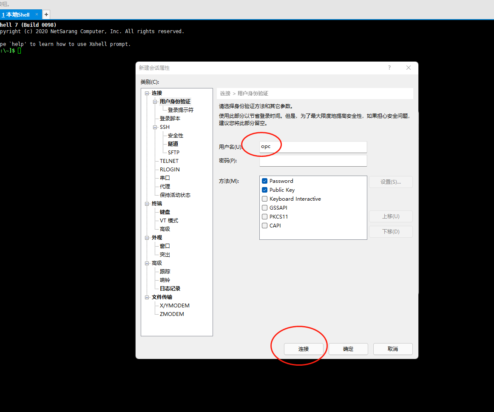
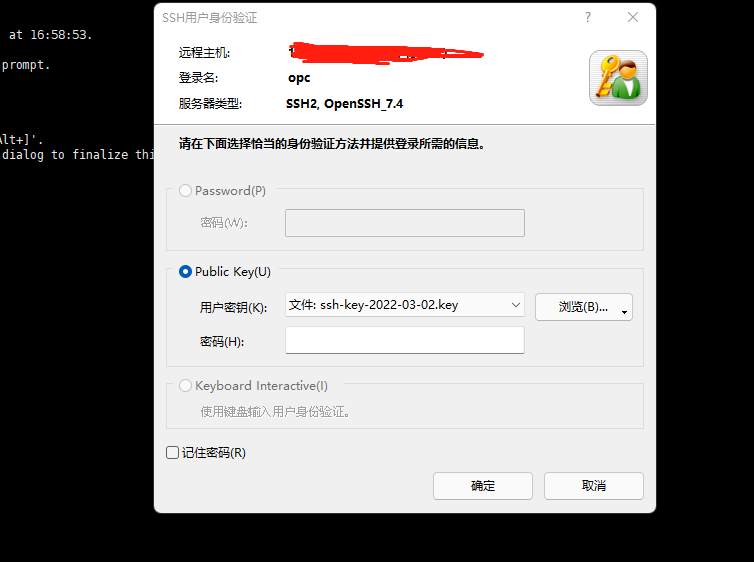
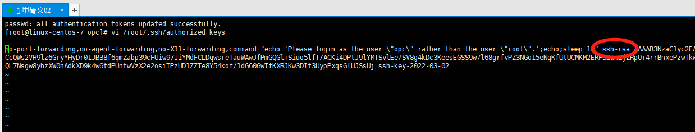
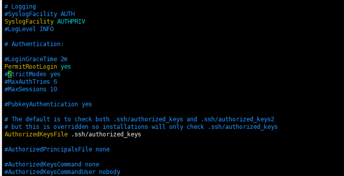
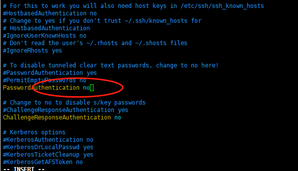

# VPS折腾总结

## 一、 登录
### 默认使用私钥直接登录，但通过以下配置改成`root`加密码登录。  

### 1. 使用密钥登录。RedHat/CentOS默认用户为`opc`，Ubuntu/Debian为`root`。
  
### 点击连接后选择导入的密钥

### 2. 切换到`root`用户并修改初始密码
### 使用以下命令：
> `sudo su`  
> `passwd`  
### 3. 修改登录方式
### **更简单的方法(执行完下面的代码后重启直接即可)：**
> ` sudo sed -i 's/^#\?PermitRootLogin.*/PermitRootLogin yes/g' /etc/ssh/sshd_config;`  
> ` sudo sed -i 's/^#\?PasswordAuthentication.*/PasswordAuthentication yes/g' /etc/ssh/sshd_config;`  
### **修改第一处：**
> ` vi /root/.ssh/authorized_keys`  
### 找到 `ssh-rsa`字样， 按键盘`i`进入编辑模式，将`ssh-rsa`前面的内容全部删除。

### 修改以后按`Esc`键退出编辑模式，`:wq`回车保存。
### **修改第二处：**
> ` vi /etc/ssh/sshd_config`  
### 找到`#PermitRootLogin`字样，去掉前面的`#`号，如下：

### 找到`PasswordAuthentication no`字样，把`no`改成`yes`如下:

### 4. 重启
> `reboot`
### 
## 二、 端口开放
### 1. 首先安装
> `iptables-persistent`  
> `apt-get install iptables-persistent`
### 2. 添加规则
> `iptables -P INPUT ACCEPT`  
> `iptables -P FORWARD ACCEPT`  
> `iptables -P OUTPUT ACCEPT`  
> `iptables -F`  
> `iptables-save`
### 3. 持久化
> `netfilter-persistent save`  
> `netfilter-persistent reload`
## 三、 证书申请
### 1. 拉取脚本并执行
> `apt update -y`  
> `apt install -y curl`  
> `apt install -y socat`  
> `curl https://get.acme.sh | sh`  
> `~/.acme.sh/acme.sh --register-account -m husmallcutie@gmail.com`   
### 2. 申请证书  
> `~/.acme.sh/acme.sh --issue -d www.hucutie. --standalone`  
> `~/.acme.sh/acme.sh --installcert -d www.hucutie. --key-file /root/private.key --fullchain-file /root/cert.crt`  
### 3. 证书格式转换  
#### 3.1 证书格式  
**PEM**  
文件头尾分别有`-----BEGIN CERTIFICATE-----`和`-----END CERTIFICATE-----`，
多个证书甚至私钥都可以放在同一个PEM文件里。  
特点如下：  
Base64编码的ASCII文件  
`.pem`，`.crt`，`.cer`，`.key`后缀  

**PFX/PKCS#12**  
用来存放服务证书，证书和私钥存放在同一个加密的文件里。  
特点如下：  
二进制格式文件  
`.pfx`，`.p12`后缀  

**DER**  
PEM格式证书的二进制形式。所有类型的证书和私钥都可以编码成DER格式。  
特点如下：  
二进制格式文件  
`.cer`，`.der`后缀  

**P7B/PKCS#7**  
文件头尾分别有`-----BEGIN PKCS7-----`和`-----END PKCS7-----`，仅能包含证书，不能存放私钥。  
特点如下：  
Base64编码格式文件   
`.p7b`，`.p7c`后缀  

#### 3.2 转换
**PEM**  
to DER 
> `openssl x509 -outform der -in certificate.pem -out certificate.der`  

to P7B 
> `openssl crl2pkcs7 -nocrl -certfile certificate.cer -out certificate.p7b -certfile CAcert.cer`  

to PFX 
> `openssl pkcs12 -export -out certificate.pfx -inkey privateKey.key -in certificate.crt -certfile CAcert.crt`  

**DER**  
to PEM  
> `openssl x509 -inform der -in certificate.cer -out certificate.pem`  

**P7B**  
to PEM  
> `openssl pkcs7 -print_certs -in certificate.p7b -out certificate.cer`  

to PFX
> `openssl pkcs7 -print_certs -in certificate.p7b -out certificate.cer`

**PFX**  
to PEM  
> `openssl pkcs12 -in certificate.pfx -out certificate.cer -nodes`

## 四、面板搭建
### 1. 拉取脚本并执行
> `bash <(curl -Ls https://raw.githubusercontent.com/vaxilu/x-ui/master/install.sh)`  
### 2. 路径设置  
公钥路径：`/root/cert.crt`  
私钥路径：`/root/private.key`

## 五、密钥登录
### 1. 生成密钥对
> `ssh-keygen`  
### 2. 将公钥写入到`authorized_keys`文件  
> `cd .ssh/`  
> `cat id_rsa.pub >> authorized_keys`   
### 3. 将密钥拷下来  
### 4. 修改权限  
> `chmod 600 authorized_keys`  
> `chmod 700 ~/.ssh`  
### 5. 开启密钥登录选项  
> `vim /etc/ssh/sshd_config`  
> `PubkeyAuthentication yes`
### 6. 重启服务  
> `service sshd restart`

## 六、连接提示语  
### 可在`/etc/motd`中编辑  
> `vim /etc/motd`  
